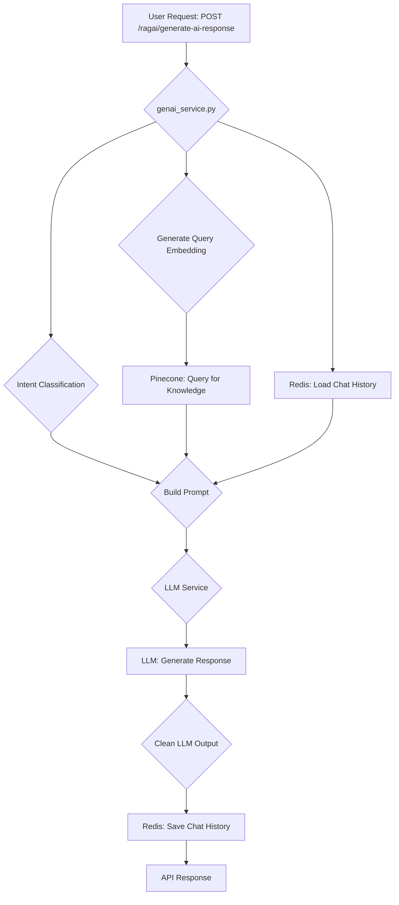

# Python AI Chatbot (RAG with FastAPI, Pinecone, LangChain, Redis)

This project is a production-ready AI microservice for building SaaS-based chatbots using Retrieval-Augmented Generation (RAG). It leverages FastAPI, Pinecone, LangChain, and Redis for scalable, modular, and persistent AI chat experiences.

## About The Project

This project provides a robust foundation for creating intelligent, context-aware chatbots. By combining the power of Large Language Models (LLMs) with a vector database, the chatbot can answer questions based on a knowledge base of your documents. This RAG approach reduces hallucinations and allows the chatbot to provide accurate and relevant information.

The application is built with a modular architecture, making it easy to extend and customize. It includes features like persistent chat memory, dynamic intent classification, and support for custom embedding models.

## Features
- **FastAPI**: High-performance API server for chatbot interactions.
- **Retrieval-Augmented Generation (RAG)**: Combines LLMs with semantic search over your documents to provide context-aware answers.
- **Pinecone**: Vector database for fast, scalable semantic search.
- **LangChain**: Modular prompt building, memory, and retriever integration.
- **Redis**: Persistent chat memory (last 10 messages per session).
- **Custom Embeddings**: Supports your own embedding API for semantic search.
- **Intent Classification**: Lightweight, built-in intent classification to route user queries (e.g., greeting, agent request, scheduler).
- **Dockerized**: Ready for containerized deployment with Docker and Docker Compose.

## Project Tree
```
/
├── .dockerignore
├── .gitignore
├── docker-compose.yml
├── Dockerfile
├── embedding.py
├── genai_service.py
├── intent_classification.py
├── knowledgesource.py
├── llm.py
├── main.py
├── models.py
├── pinecone_client.py
├── README.md
├── requirements.txt
├── genai_core/
│   ├── __init__.py
│   ├── embedding_service.py
│   ├── hf_config.py
│   ├── llm_service.py
│   └── tools.py
└── utils/
    ├── __init__.py
    ├── chunking.py
    ├── prompt_builder.py
    └── redis_client.py
```

## Project Structure
- `main.py`: FastAPI app entrypoint, defines API endpoints for health checks, knowledge upload, and chat generation.
- `genai_service.py`: Core AI logic, including RAG, memory management, and prompt orchestration.
- `knowledgesource.py`: Handles file uploads, chunking, and embedding of knowledge base documents.
- `embedding.py`: Service for generating embeddings using a local sentence-transformer model.
- `intent_classification.py`: A hybrid intent classifier (TF-IDF and optional BERT) to determine user intent.
- `llm.py`: A wrapper for interacting with Large Language Models (LLMs) like Grok.
- `pinecone_client.py`: Initializes the Pinecone index for vector storage and retrieval.
- `models.py`: Pydantic models for API request and response validation.
- `genai_core/`: Core AI modules.
  - `embedding_service.py`: A service for generating text embeddings.
  - `llm_service.py`: A service for generating text with LLMs using LangChain and HuggingFace.
  - `tools.py`: Defines tools for the AI agent (e.g., web search, ticket creation).
- `utils/`: Utility functions.
  - `chunking.py`: Text chunking utilities for document processing.
  - `prompt_builder.py`: Functions for building dynamic and context-aware prompts.
  - `redis_client.py`: Manages Redis connection and chat history.

## Generate AI Response Flow



## API Documentation

### Health Check
- **Endpoint**: `GET /health/genai`
- **Description**: Checks the health of the local LLM and embedding models.
- **Response**:
  ```json
  {
    "status": "ok",
    "models": {
      "llm": {
        "loaded": true,
        "class": "LLMService"
      },
      "embedding": {
        "loaded": true,
        "class": "EmbeddingService",
        "device": "cuda"
      }
    }
  }
  ```

### Knowledge Base
- **Endpoint**: `POST /bots/{bot_id}/knowledge/upload`
- **Description**: Uploads and processes knowledge base files for a specific bot.
- **Request Body**: `multipart/form-data` with `files` and `knowledge_source_id`.
- **Response**:
  ```json
  {
    "message": "Files uploaded and embedded successfully.",
    "files": [
      {
        "fileName": "example.pdf",
        "status": "completed",
        "chunks": 10
      }
    ]
  }
  ```

- **Endpoint**: `DELETE /knowledge/pinecone/{source_id}`
- **Description**: Deletes knowledge base entries from Pinecone for a specific `source_id`.
- **Query Parameters**: `bot_id`
- **Response**:
  ```json
  {
    "deleted": true,
    "source_id": "your_source_id"
  }
  ```

### Chat
- **Endpoint**: `POST /ragai/generate-ai-response`
- **Description**: Generates a response to a user query using the RAG pipeline.
- **Request Body**:
  ```json
  {
    "bot_id": "your_bot_id",
    "session_id": "your_session_id",
    "user_query": "Your question here",
    "tenant_name": "Optional tenant name",
    "tenant_description": "Optional tenant description",
    "ai_node_data": {}
  }
  ```
- **Response**:
  ```json
  {
    "fullText": "The full, raw response from the LLM.",
    "cleanText": "The cleaned, user-facing response.",
    "action": "The detected intent (e.g., 'normal_qa', 'agent_request')."
  }
  ```

## Setup & Installation
1. **Clone the repository**
2. **Install dependencies**
	```bash
	pip install -r requirements.txt
	```
3. **Configure environment variables**
	- Create a `.env` file with your Pinecone, Redis, and other secrets. See `.env.example` for a template.
4. **Run Redis and Pinecone**
	- Make sure Redis is running locally or update `REDIS_URL`
	- Set up your Pinecone index and API key
5. **Start the FastAPI server**
	```bash
	uvicorn main:app --reload
	```
6. **(Optional) Run with Docker**
	```bash
	docker-compose up --build
	```

## Usage
- Upload documents through the `/bots/{bot_id}/knowledge/upload` endpoint to populate the knowledge base.
- Send user queries to `/ragai/generate-ai-response` to get context-aware answers.
- The chatbot will automatically detect user intent and can be configured to trigger actions like escalating to a human agent or opening a scheduler.
